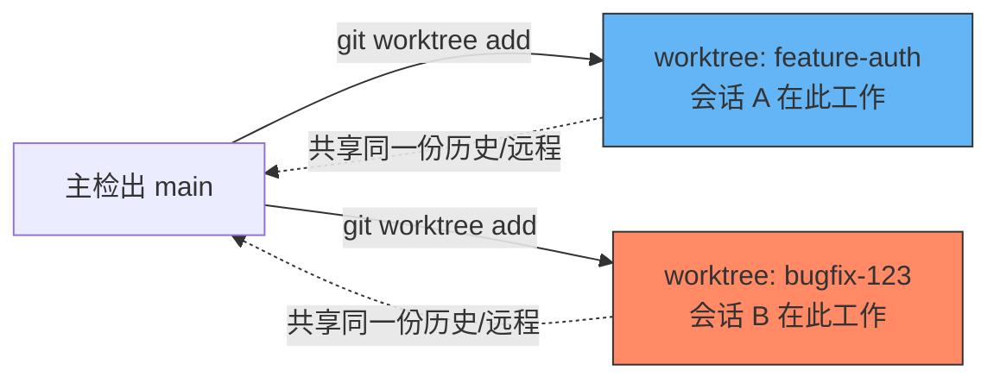

# 别再死磕 Multi-Agent 编排了
### Claude Code 原生的「代理和并行工作」全解

<div class="pt-8">
  <span @click="$slidev.nav.next" class="px-2 py-1 rounded cursor-pointer hover:bg-white hover:bg-opacity-10 text-sm">
    敲击空格键，进入正题 👇
  </span>
</div>

<div class="abs-bottom-right m-6 opacity-60 text-sm">
  内容来源：code.claude.com/docs/zh-CN（代理和并行工作 章节）
</div>

---
layout: center
class: text-sm
---

# 🚀 省流：5 种并行姿势，官方都给你装好了

Multi-Agent 协同太难？因为我们总想着自己造轮子（写 TS 编排脚本、维护状态机）。
但 **Claude Code 自带 5 种"并行运行代理"的方式**，覆盖了从"单会话内委派"到"多会话团队协作"的全部场景：

* **1. Subagents（子代理）**：会话内的委派工作者，办完事只交摘要
* **2. Agent View（代理视图）**：一个屏幕调度/监控多个后台会话
* **3. Agent Teams（代理团队）**：多个会话互相发消息、共享任务列表
* **4. Worktrees（隔离工作区）**：物理隔离文件，并行会话互不打架
* **5. `/batch`**：一句话把仓库级改造拆成 5~30 个并行子代理

---
layout: default
class: text-sm
---

# 💡 先看官方的"选型一张表"

不同方法解决不同问题：**谁来协调？要不要互相说话？会不会动同一批文件？**

| 方法 | 它提供什么 | 何时用 |
| --- | --- | --- |
| **子代理 Subagents** | 会话内的委派工作者，独立上下文，只回报摘要 | 辅助任务（搜索/日志/读文件）会刷爆主对话，且你不会再引用这些细节 |
| **代理视图 Agent View** | 一屏调度+监控后台会话，`claude agents` 打开（研究预览） | 多个独立任务，想"丢给它去做"，自己只看状态、按需介入 |
| **代理团队 Agent Teams** | 多会话协调，共享任务列表+代理间消息，由 Leader 管理（实验性，默认关闭） | 想让 Claude 自己拆任务、分配、保持团队同步 |
| **Worktrees** | 独立 git 检出，并行会话永不碰对方的文件 | 自己手动开多会话，或子代理会改到重叠文件 |
| **`/batch`** | 一条指令拆成 5~30 个 worktree 隔离子代理，每个开一个 PR | 仓库级迁移 / 机械式重构 |

<div class="mt-2 text-xs opacity-70">💡 这些方法可以组合：Agent View 调度的会话需要写文件时会自动落到独立 worktree；你的会话也能生成子代理，每个子代理再各拿一个 worktree。</div>

---
layout: two-cols
---

# 🧩 1. Subagents：会话内的"专家外包"

<div class="pr-4 text-xs leading-relaxed">

**是什么**：在主会话里委派出去的工作者，拥有自己的上下文窗口、自定义系统提示、独立工具权限，完成后只把摘要带回主对话。

**内置三个**：
- **Explore**：Haiku，只读，搜代码库
- **Plan**：plan mode 下做调研，防止无限嵌套
- **General-purpose**：继承主对话模型，全工具，处理复杂多步任务

**用它解决什么**：
- 🧹 保留上下文：探索/实现细节别污染主对话
- 🔒 约束能力：限制 subagent 能用哪些工具
- 💰 控制成本：把任务路由给更便宜的模型（如 Haiku）

</div>

::right::

<div class="pl-4 pt-2 text-[11px] leading-relaxed">

```markdown
---
name: code-reviewer
description: 审查代码质量与安全，主动在
  代码变更后调用
tools: Read, Grep, Glob, Bash
model: inherit
---
你是资深代码审查员，关注代码质量、
安全性与可维护性...
```

**调用方式**：
- 自然语言：`Use the code-reviewer
  subagent to review my changes`
- `@`-mention：精确指定哪个子代理跑
- 会话级：`claude --agent code-reviewer`

**⚠️ 限制**：subagent 之间**不能再生成** subagent（无嵌套委派），且默认从零上下文开始（除非用 `/fork`）。

</div>

---
layout: default
class: text-xs
---

# 🔁 Subagents 的两个常见模式

<div class="grid grid-cols-2 gap-6">

<div>

### 模式一：隔离高耗量操作
跑测试、抓文档、翻日志这类会产生大量输出的任务，丢给 subagent —— 详细输出留在它自己的上下文里，主对话只收到摘要。

```text
Use a subagent to run the test suite and
report only the failing tests with errors
```

### 模式二：并行研究
对互相独立的调查方向，同时开多个 subagent：

```text
Research the auth, database, and API
modules in parallel using separate subagents
```

</div>

<div>

### 模式三：链式委派
多步骤工作流，按顺序使用 subagent，前一个的结果作为上下文传给下一个：

```text
Use the code-reviewer subagent to find
performance issues, then use the optimizer
subagent to fix them
```

<div class="mt-4 p-3 bg-yellow-500/10 border border-yellow-500/30 rounded">
⚠️ <b>别贪多</b>：subagent 完成后结果会全部塞回主对话上下文。跑太多个、每个又返回详细结果，主上下文照样爆。需要"持续并行 + 各自独立上下文"，应该上 Agent Teams。
</div>

</div>

</div>

---
layout: two-cols
---

# 🖥️ 2. Agent View：一屏调度所有后台代理

<div class="pr-4 text-xs leading-relaxed">

**是什么**：`claude agents` 打开的一个屏幕，列出**所有后台会话**——在跑什么、谁需要你输入、谁已完成。会话脱离终端依然在后台跑（由独立的监督进程托管）。

**核心交互**：
- 输入框打提示 → `Enter` 调度新会话
- `Space` **窥视**：看它在干嘛/需要什么，不用打开完整对话
- `Enter` / `→` **附加**：接管终端，像平时一样交互
- `←`（空提示时）：把当前会话丢进后台，回到总览

**状态指示器**：工作中 / 需要输入 / 空闲 / 已完成 / 失败 / 已停止

</div>

::right::

<div class="pl-4 pt-4 text-xs leading-relaxed">

```bash
# 后台直接起一个会话
claude --bg "investigate the flaky test"

# 指定某个 subagent 作为主代理
claude --agent code-reviewer --bg \
  "address review comments on PR 1234"

# 从 shell 管理
claude attach <id>   # 接管
claude logs <id>      # 看最近输出
claude stop <id>      # 停止
claude respawn --all  # 唤醒所有已停止
```

<div class="mt-3 p-3 bg-blue-500/10 border border-blue-500/30 rounded">
💡 <b>文件编辑自动隔离</b>：后台会话默认禁止写主目录；一旦要写文件，Claude 自动把它挪进 <code>.claude/worktrees/</code> 下的独立 worktree，互不冲突。
</div>

<div class="mt-2 text-[10px] opacity-70">⚠️ 研究预览功能，且速率限制照算：开 10 个并行代理 = 配额消耗快 10 倍。</div>

</div>

---
layout: two-cols
---

# 👥 3. Agent Teams：会互相吵架的代理团队

<div class="pr-4 text-xs leading-relaxed">

**是什么**：多个 Claude Code 实例组队工作，一个会话当 **Team Lead**（协调/分配/综合结果），队友各自拥有独立上下文，并能**直接互相发消息**——这正是和 subagent 最大的区别。

**默认禁用，需开启**：
```json
{
  "env": {
    "CLAUDE_CODE_EXPERIMENTAL_AGENT_TEAMS": "1"
  }
}
```

**最适合**：
- 研究/审查：多角度同时调查，再互相质疑发现
- 新模块/功能：队友各拥一块，互不打扰
- 竞争假设调试：并行测试多个理论，加速收敛
- 跨层协调：前端/后端/测试各有队友

</div>

::right::

<div class="pl-4 pt-2 text-[11px] leading-relaxed">

```text
Create an agent team to review PR #142.
Spawn three reviewers:
- One focused on security
- One checking performance impact
- One validating test coverage
Have them each review and report findings.
```

**架构四要素**：Team Lead / Teammates / 共享任务列表 / Mailbox（消息系统）

**对比子代理**：

| | Subagents | Agent Teams |
|---|---|---|
| 通信 | 只向主代理报告 | 队友间直接发消息 |
| 协调 | 主代理全权管理 | 共享任务列表+自我认领 |
| 令牌成本 | 较低 | 明显更高 |

<div class="mt-2 p-2 bg-red-500/10 border border-red-500/30 rounded text-[10px]">
⚠️ 实验性功能：In-process 队友不支持 <code>/resume</code>；每个会话只能管理一个团队；队友不能再生成队友。
</div>

</div>

---
layout: default
class: text-sm
---

# 🌳 4. Worktrees：让并行会话physically 不打架

物理隔离才是并行协作的地基——子代理、代理团队解决"协调"问题，worktree 解决"文件冲突"问题。



```bash
# 一条命令：创建隔离 worktree 并在其中启动会话
claude --worktree feature-auth     # 另开终端
claude --worktree bugfix-123       # 互不冲突

# 自定义子代理永久走 worktree 隔离
# 在 subagent frontmatter 加一行：
# isolation: worktree
```

* 🌟 **`.worktreeinclude`**：解决 `.env`、密钥等 gitignored 文件在新 worktree 里"凭空消失"的问题
* 🌟 **清理机制**：无改动自动删除；有改动会提示保留或丢弃；子代理 worktree 完成无变更时自动清理

---
layout: two-cols
---

# 🛠️ 落地：把"前端开发流水线"接到官方能力上

之前我们自己拼的"前端架构师→开发→QA→视觉审查"四角色协同，现在可以直接映射到官方组件：

<div class="pr-2 text-[11px] leading-relaxed">

### 纵向流水线（单一需求）
用 **subagent 链式委派**：

```text
Use the architect subagent to plan the
component split, then the coder subagent
to implement it, then the qa subagent to
run lint & tests
```

每一步的详细输出（lint 报告、测试日志）都留在各自 subagent 上下文里，主对话只看到结论。

</div>

::right::

<div class="pl-2 text-[11px] leading-relaxed">

### 横向并发（多个需求）
用 **Agent View** 或手动 **worktree**：

```bash
claude --bg "实现需求 A：UserForm 组件"
claude --worktree bugfix-123
```

`claude agents` 一屏看三个任务的状态，谁卡住了就 `Space` 窥视一下，回个话继续跑。

### 需要"吵架"式协作时
上 **Agent Teams**：让安全/性能/测试三个队友同时审查同一个 PR，各自报告后由 Lead 综合——比一个模型自己审查更难漏判。

</div>

---
layout: default
class: text-sm
---

# ⚠️ 组内避坑：官方文档里藏的"真心话"

<div class="grid grid-cols-2 gap-6 text-xs leading-relaxed">

<div>

### 1. 不是越并行越好
- Agent Teams：3~5 个队友是甜点区，超过收益递减、协调开销线性上升
- 任务太小：协调开销盖过收益；任务太大：队友闷头干太久才被发现走偏
- 顺序任务、改同一文件、强依赖关系 → 单会话或子代理更合适，别上团队

### 2. 别让"分身"互相打架
- Worktrees 才是文件隔离的根本手段；Agent Teams 不自带隔离，需要**自己分区文件**
- 两个队友编辑同一文件 = 直接覆盖

</div>

<div>

### 3. Token 是真金白银
- 并行跑多个会话/子代理 = 配额消耗成倍增加（agent view 同理）
- Agent Teams 比单会话明显更贵：每个队友都是独立实例

### 4. 人类仍然是最后一道闸
- Agent Teams：负责人可能在任务真正完成前就喊"收工"——明确告诉它"等队友做完"
- 复杂/高风险任务可要求队友先进入 plan mode，**批准计划后才允许动手**

</div>

</div>

---
layout: center
class: text-center text-sm
---

# 总结：选对工具，而不是死磕编排脚本

<div class="my-4 text-lg font-serif">
"Multi-Agent 协同没那么难——<br>难的是我们总想自己重新发明它。"
</div>

```
   单个任务，怕刷爆上下文？           多个独立任务，想丢着跑？
        ↓                                  ↓
     Subagents                         Agent View
        │                                  │
   需要队友互相讨论/质疑？             怕大家改同一份文件？
        ↓                                  ↓
     Agent Teams                       Worktrees
```

* **先问自己三个问题**：谁协调？要不要互相说话？会不会碰同一批文件？
* **从小处试起**：先用 subagent 做研究/审查，再考虑 worktree 隔离，最后才上 Agent Teams

---
layout: center
class: text-center
---

# Q & A

### 感谢大家！

大家在自己的项目里，更倾向用哪种并行姿势？或者已经踩过哪些坑？