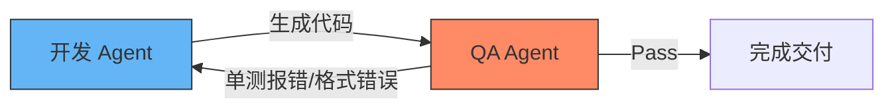

# 别再单兵作战了，让 AI 们自己吵起来！

### 多 Agent 协作系统在前端开发与个人效率（Obsidian）的落地姿势

<div class="pt-8">
  <span @click="$slidev.nav.next" class="px-2 py-1 rounded cursor-pointer hover:bg-white hover:bg-opacity-10 text-sm">
    敲击空格键，进入正题 👇
  </span>
</div>

<div class="abs-bottom-right m-6 opacity-60 text-sm">
  分享人：我们组的前端
</div>

---
layout: center
class: text-sm
---

# 🚀 省流：今天我们只聊干货，不画大饼

30分钟，带你快速解锁 Multi-Agent 的真实姿势：

* **1. 单兵 Agent 怎么死掉的**：为什么你的 200 行 Prompt 越来越难用？
* **2. 前端开发“小剧场”**：让不同的 Agent 互相纠错，释放我们 Review 和测试的时间。
* **3. 摸鱼神器 Obsidian**：不用写代码，如何用 Obsidian 连线多个 Agent 自动整理笔记和生成周报。
* **4. JS 开发者的第一站**：简单好上手的开源轮子（不讲深奥算法）。

---
layout: two-cols
---

# 💀 单兵 Agent 的真实死法

平时大家用 AI，是不是经常遇到这些场景？

<div class="pr-4 text-xs leading-relaxed">

- 🤯 **“Prompt 屎山”**
  - 为了让 AI 写个 Vue 组件，你把 Props 定义、Tailwind 规范、防抖逻辑、单测要求全写进 Prompt。
  - **结果**：AI 脑过载，不是漏样式，就是写错逻辑。

- 🧠 **上下文遗忘症**
  - 塞了几个大文件后，AI 开始胡言乱语，忘了半小时前定下的组件规范。

- 🔄 **手动“人肉搬运” Error**
  - 编译报错了 ➡️ 复制报错 ➡️ 贴给 AI ➡️ AI 给出新代码 ➡️ 复制新代码 ➡️ 编译又报错...
  - **我们成了 AI 之间通信的工具人！**

</div>

::right::

<div class="pl-4 pt-4">
  <div class="p-4 bg-red-500/10 border border-red-500/30 rounded-lg text-xs">
    <h3 class="text-red-400 font-bold mb-1">🔥 核心痛点</h3>
    <p class="text-gray-300">
      面对长链路、多职责的复杂前端任务，“单兵作战”的 Agent 容易陷入<b>“生成-出错-人肉反馈-再次出错”</b>的死循环。
    </p>
  </div>
  
  <div class="mt-4 p-4 bg-green-500/10 border border-green-500/30 rounded-lg text-xs">
    <h3 class="text-green-400 font-bold mb-1">💡 破局之道：Multi-Agent</h3>
    <p class="text-gray-300">
      把复杂任务拆解，交给扮演不同角色的 Agent。<b>把“Prompt 调优的玄学”转变为“SOP 流程设计的工程学”。</b>
    </p>
  </div>
</div>

---
layout: two-cols
---

# 💡 多 Agent 的两种经典协作模式

多 Agent 到底是“多打一”还是“多对多”？**答案是：两者皆有，方向不同。**

<div class="pr-2 text-[11px] leading-relaxed">

### 1. 纵向协同：多 Agent 搞定【单一需求】
- **模式**：把一个复杂需求（如写一个组件）拆解给不同角色的 Agent。
- **角色**：架构师 Agent ➡️ 开发 Agent ➡️ 测试 Agent ➡️ 审计 Agent。
- **目的**：**提高成功率**。避免单模型精力分散，利用 SOP 实现高质量交付。
- **典型场景**：PRD 需求整理 ➡️ 组件开发 ➡️ ESLint 纠错自检线。

</div>

::right::

<div class="pl-4 text-[11px] leading-relaxed">

### 2. 横向并发：多 Agent 应对【多个事项】
- **模式**：启动多个独立工作区，分派多个 Agent 并行处理不同任务。
- **角色**：Agent A 处理需求 A，Agent B 处理需求 B，Agent C 修复 Bug。
- **目的**：**提高吞吐量**。释放开发者的等待时间，实现多任务异步并发。
- **典型场景**：在不同的 Git Worktree 中并行开发和修复 Bug。

</div>

<div class="col-span-2 mt-4 p-3 bg-blue-500/10 border border-blue-500/30 rounded text-[11px]">
  💡 <b>终极形态：纵横混合</b>。横向派发 3 个并发任务，每个任务内部又是由 Coder 和 Tester 两个 Agent 纵向协作搞定。
</div>

---
layout: two-cols
---

# 前端工作流中的角色定义

我们可以将前端研发链路中的岗位，映射为不同的数字 Agent：

<div class="pr-4 text-xs leading-relaxed">

### 🧑‍💻 1. 前端架构师 Agent (Architect)
- **职责**：需求拆解、技术选型、定义组件 Props 规范。
- **输入**：PRD / 用户描述 ➡️ **输出**：组件方案 JSON。

### ✍️ 2. 前端开发 Agent (Coder)
- **职责**：编写具体的 HTML/CSS/JS、实现交互。
- **输入**：Props 规范 + 设计 Token ➡️ **输出**：组件代码。

</div>

::right::

<div class="pl-4 text-xs leading-relaxed">

### 🧪 3. 质量保障 Agent (QA & Linter)
- **职责**：运行静态检查（ESLint）、编写并运行单测、分析报错日志。
- **输入**：代码 ➡️ **输出**：Lint 报告 / 测试覆盖率。

### 🎨 4. 视觉审查 Agent (Visual Reviewer)
- **职责**：截图对比，分析页面样式与设计稿的像素差异。
- **输入**：页面截图 + Figma ➡️ **输出**：样式修正意见。

</div>

---
layout: default
class: text-sm
---

# 协作拓扑：Agent 之间如何“说话”？

多 Agent 系统的协作结构决定了工作流的效率与灵活性。

### 1. 线性管道模式 (Sequential Pipeline)
适合步骤分明的流水线任务：
$$\text{Figma 解析} \longrightarrow \text{组件编码} \longrightarrow \text{单元测试} \longrightarrow \text{部署发布}$$

### 2. 双向反馈/自检循环模式 (Circular Feedback Loop)
引入“评审-修改”闭环，这是多 Agent 系统的最大威力所在：



* 🌟 **爽点**：Coder 写出 Bug 时，QA 跑单测报错，直接把 Error 丢回给 Coder。**我们在旁边喝茶，等它们自己修复到 Pass**。

---
layout: two-cols
---

# 场景一：基于 PRD 的需求整理与开发

实现从需求文档到符合规范的 Vue 3 组件。

<div class="pr-2 text-[11px] leading-relaxed">

* **开发流程**：
  1. **Analyst Agent** 提取 PRD 交互逻辑并输出开发规约。
  2. **Architect Agent** 对接组件库文档，规划组件拆分。
  3. **Coder Agent** 编写 Vue 3 代码。

</div>

::right::

<div class="pl-2 text-[11px] leading-relaxed">

### 🛠️ agy 实现方案
- **运行命令**：
  `agy subagent run --role analyst --prompt "解析 PRD 并整理组件设计"`
- **机制**：`agy` 通过本地 **MCP** 读取私有组件库文档，产出组件规约 JSON，分发给子 `coder` 进行开发。

### 🛠️ claude code 实现方案
- **运行命令**：在终端启动交互式命令行，运行：
  `claude "参考 @components 目录下的 Vue 组件规范，分析 user_prd.md 并开发 UserForm.vue 组件"`
- **机制**：直接使用交互式控制台，依靠 `/edit` 读写文件。

</div>

---
layout: two-cols
---

# 场景二：测试驱动的 UI 自动化修复

前端需求变更时，最容易碎掉的是测试脚本。

<div class="pr-2 text-[11px] leading-relaxed">

* **修复流程**：
  1. **Executor** 跑 Vitest/Playwright 并捕获报错。
  2. **Analyzer** 分析报错位置和代码上下文。
  3. **Healer** 自动更新测试或组件代码并重跑，直至 Pass。

</div>

::right::

<div class="pl-2 text-[11px] leading-relaxed">

### 🛠️ agy 实现方案
- **机制**：在 `agy.config.json` 中配置任务命令链。`agy` 自动执行测试，若遇到错误，捕获 `stdout/stderr` 输出，并启动子 Agent `tester-fix` 进行自我调试，形成闭环直至测试通过退出码为 0。

### 🛠️ claude code 实现方案
- **机制**：在命令行直接执行交互式命令：
  `claude "运行 npm run test 并在报错时自动修复它"`
- **机制**：Claude 会主动运行该测试指令，捕获报错后修改相应的 Vue 组件代码并自动重复执行，直到测试通过。

</div>

---
layout: two-cols
---

# 🧠 非编码场景下的 Multi-Agent

**“我不想写代码，但我有大量文档、笔记和日常琐事，怎么用 Multi-Agent 提效？”**

<div class="pr-4 text-xs leading-relaxed">

### 1. 知识卡片“流水线” 📥
- **Agent A (速读)**：从长文章/PDF 中提取 3 个核心干货。
- **Agent B (翻译)**：将内容翻译，用大白话解释名词。
- **Agent C (分类)**：打上合适的 Tag 并关联到已有笔记。

### 2. 自动化“周报生成器” 📊
- 每天下班在随笔里随手记一两句话。
- 周末，由**整理 Agent** 收集随笔，交给**润色 Agent** 扩写，再交给**主管 Agent** 审核语气，一键导出。

</div>

::right::

<div class="pl-4 pt-6 text-xs">
  <div class="p-4 bg-purple-500/10 border border-purple-500/30 rounded-lg">
    <h3 class="text-purple-400 font-bold mb-1">⚡ 为什么非编码场景也需要多 Agent？</h3>
    <p class="text-gray-300 leading-relaxed">
      如果直接让一个大模型总结周报，它会写得大而无当。但如果让<b>“提取 Agent”</b>提取事实，再由<b>“文案 Agent”</b>套用模板，最后由<b>“校对 Agent”</b>删减废话，效果能直接达到“可发送”的水平。
    </p>
  </div>
</div>

---
layout: two-cols
---

# 场景三：在 Obsidian 中打造个人参谋部

不用写代码，利用连线关系在笔记中跑通多 Agent。

<div class="pr-2 text-[11px] leading-relaxed">

* **连线流程**：
  `[文章 PDF] ➡️ [A: 事实提取] ➡️ [B: 逻辑质疑] ➡️ [C: 前端 Action 转化]`
* **效果**：只读最后的卡片 C，就吃透了文章并得到了前端落地指南。

</div>

::right::

<div class="pl-2 text-[11px] leading-relaxed">

### 🛠️ agy 实现方案
- **机制**：`agy` 提供本地 **Sidecar API** 服务。
- **调用**：在 Obsidian 中通过 Templater 脚本，直接向 `fetch('http://localhost:agy/subagent')` 发送 POST，链式串联三个 Agent 的输入输出完成笔记自动流转。

### 🛠️ claude code 实现方案
- **机制**：利用 Shell 管道在 Obsidian 终端插件中运行：
  `cat doc.md | claude "提取事实" | claude "质疑逻辑漏洞" > action.md`
- **调用**：使用 CLI 命令链，在后台快速批处理文档笔记。

</div>

---
layout: two-cols
---

# JS 开发者的第一只 Agent 工具箱

既然我们要构建多 Agent，前端开发用什么最顺手？

<div class="pr-2 text-xs leading-relaxed">

### 1. LangGraph.js (极力推荐)
- **为什么**：支持“图（Graph）”结构，完美解决循环纠错（A ➡️ B ➡️ A）的业务逻辑。
- **体验**：纯 TS 开发，复用 ESLint、Vite 等 Node API。

### 2. Vercel AI SDK
- **为什么**：天然支持流式渲染（Streaming），提供 `@ai-sdk/vue` 极其方便在 Vue/Nuxt 中使用。

</div>

::right::

<div class="pl-2 pt-2 text-[10px] scale-95 origin-top-left">

```typescript
// 用 JS 定义一个简单的纠错环 (伪代码)
import { StateGraph } from "@langchain/langgraph";

const workflow = new StateGraph()
  .addNode("coder", coderAgent)
  .addNode("tester", testerAgent)
  .addEdge("coder", "tester") // 写完去测
  .addConditionalEdges(
    "tester",
    (state) => state.hasBug ? "coder" : "end" 
    // 有 Bug 回去改，没 Bug 结束
  );
```

</div>

---
layout: two-cols
---

# 💡 进阶思考：必须用脚本控制多 Agent 吗？

不用写任何 TS/Python 编排代码，利用 **Git Worktree** 也能跑通多 Agent！

<div class="pr-2 text-[11px] leading-relaxed">

### 1. 物理级隔离的多工作区
- Coder 在 `/worktree-coder` (分支 `feat/xxx`) 开发 Vue 组件。
- Tester 在 `/worktree-tester` (分支 `test/xxx`) 跑测试并纠错。
- **好处**：彻底避免了文件修改冲突、端口占用和 Vite 热更新频繁锁死。

### 2. 基于 Git 状态机的异步编排
- 它们不需要实时的 WebSocket / 内存对象通信。
- 而是通过 **`git commit`、`git merge`、`git diff` 和 PR/Webhook** 完成状态同步与评审。
- **效果**：所有 Agent 的每一次交互和修改，都在 Git Commit 历史中清晰可见、100% 可追溯。

</div>

::right::

<div class="pl-4 pt-10 text-xs">
  <div class="p-4 bg-blue-500/10 border border-blue-500/30 rounded-lg">
    <h3 class="text-blue-400 font-bold mb-1">🛠️ Google Antigravity 的原生支持</h3>
    <p class="text-gray-300 leading-relaxed">
      正如我们现在所用的 AI 工具（Antigravity），在唤起 Subagent 时就原生提供了 <b>share 模式</b>（底层基于 Git Worktree 共享仓库但隔离物理工作区），实现了无感知的分支解耦研发。
    </p>
  </div>
  
  <div class="mt-4 p-4 bg-green-500/10 border border-green-500/30 rounded-lg">
    <h3 class="text-green-400 font-bold mb-1">🔥 核心启示</h3>
    <p class="text-gray-300 leading-relaxed">
      不要把多 Agent 局限在“大语言模型”和“应用脚本”中。<b>Git 分支管理和团队研发规范（SOP），本就是天然的多 Agent 协作协议！</b>
    </p>
  </div>
</div>

---
layout: two-cols
---

# 场景四：多任务并行的“分身术”

你正在写需求 A，突然来了需求 B 和紧急 Bug Fix...

<div class="pr-2 text-[11px] leading-relaxed">

* **痛点**：传统切分支、Stash、重启服务极度打断思维。
* **解决**：利用 **Git Worktree** 让 Agent A 在 `/wt-a` 开发需求 A，Agent B 在 `/wt-b` 并行写需求 B，自己留在主目录改 Bug。

</div>

::right::

<div class="pl-2 text-[11px] leading-relaxed">

### 🛠️ agy 实现方案
- **运行命令**：
  `agy subagent run --workspace share --role coder-b`
- **机制**：主控 `agy` 自动在后台创建一个 Git Worktree，将子 Agent 的物理工作区隔离运行，不需要你在终端开新窗口或中断当前进程。

### 🛠️ claude code 实现方案
- **运行命令**：
  `git worktree add ../wt-b feat/b`
- **机制**：开发人员手动拉起 Worktree 目录，在新的终端标签页里执行：
  `cd ../wt-b && claude`
  在独立的命令行沙箱中为需求 B 生成代码并测试。

</div>

---
layout: two-cols
---

# 场景五：跨仓库（Cross-Repo）协同

仓库 A 正在写代码，突然要求去仓库 B（UI 库）修改并完成联调。

<div class="pr-2 text-[11px] leading-relaxed">

* **问题**：开发 A1 的同时，并发修改 B1/B2 并不发包完成实时本地联调。
* **解决**：**Linker Agent** 在仓库 B 运行 `yalc publish`，在仓库 A 运行 `yalc add` 本地物理连通。

</div>

::right::

<div class="pl-2 text-[11px] leading-relaxed">

### 🛠️ agy 实现方案
- **运行命令**：
  `agy subagent run --workspace D:/code/repo-b --role helper`
- **机制**：`agy` 支持传入其他仓库的绝对路径作为 `workspace`。子 Agent 的文件修改和命令执行将被自动重定向到 `repo-b`，同时通过主 `agy` 调度本地 `yalc` 完成联调。

### 🛠️ claude code 实现方案
- **运行命令**：
  在 Terminal 1 (repo-b): `claude "修改 Button 组件"`
  在 Terminal 2 (repo-a): `yalc link repo-b`
- **机制**：打开两个终端窗口，在各自的目录下运行 `claude` 实例。手动运行 `yalc` 完成物理依赖连接。

</div>

---
layout: two-cols
---

# ⚠️ 组内避坑：别让 Agent 变成“吞钱机器”

玩多 Agent 协作时，我们踩过的几个真金白银的坑：

<div class="pr-4 text-xs leading-relaxed">

### 1. 提防“死循环”（Infinite Loops）
- **惨案**：Coder 写了 Bug ➡️ Tester 报错 ➡️ Coder 修复又写了新 Bug ➡️ Tester 再次报错...
- **结果**：一觉醒来，几百万 Token 没了，模型还在反复横跳。
- **解法**：**必须限制最大循环次数**（如 Max Loop = 3），超过就强制报警让“人类”接入。

### 2. 模型混搭（Model Mixing）
- 别什么角色都用最贵的 GPT-4o / Gemini Pro。
- 代码审计、格式排版用便宜的 8B/70B 本地模型（如 Ollama 本地跑），核心逻辑才用昂贵的闭源大模型。

</div>

::right::

<div class="pl-4 pt-6 text-xs">
  <div class="p-4 bg-yellow-500/10 border border-yellow-500/30 rounded-lg">
    <h3 class="text-yellow-400 font-bold mb-1">💡 黄金法则：Human-in-the-loop</h3>
    <p class="text-gray-300 leading-relaxed">
      永远不要给 Agent 自动合并代码到 Master 或自动付钱的权限。多 Agent 相当于我们的<b>“数字实习生”</b>，它们把脏活累活干完、排好版，最后一步必须由<b>我们点击 Approve</b>。
    </p>
  </div>
</div>

---
layout: center
class: text-center text-sm
---

# 总结：未来我们的工作姿势

<div class="my-4 text-lg font-serif">
  “我们不再是手敲代码的工匠，<br>而是调度 AI 团队的研发主管。”
</div>

```
             ┌─────────────────────────┐
             │       前端开发 (你)       │
             └───────────┬─────────────┘
                         │ 设定 SOP & 检查
                         ▼
   ┌───────────┐   ┌───────────┐   ┌───────────┐
   │ Coder Agt │──►│ Linter Agt│──►│ Test Agent│
   └───────────┘   └───────────┘   └───────────┘
```

* **SOP 才是新的 Prompt**：把你的经验整理成标准研发步骤。
* **多用非编码场景练手**：先在 Obsidian Canvas 里组建你的“论文速读三人组”，体验 Agent 吵架的乐趣。

---
layout: center
class: text-center
---

# Q & A

### 感谢大家，一起快乐摸鱼！

大家有在 Obsidian 里试过类似工具吗？或者对 LangGraph.js 有什么看法？
